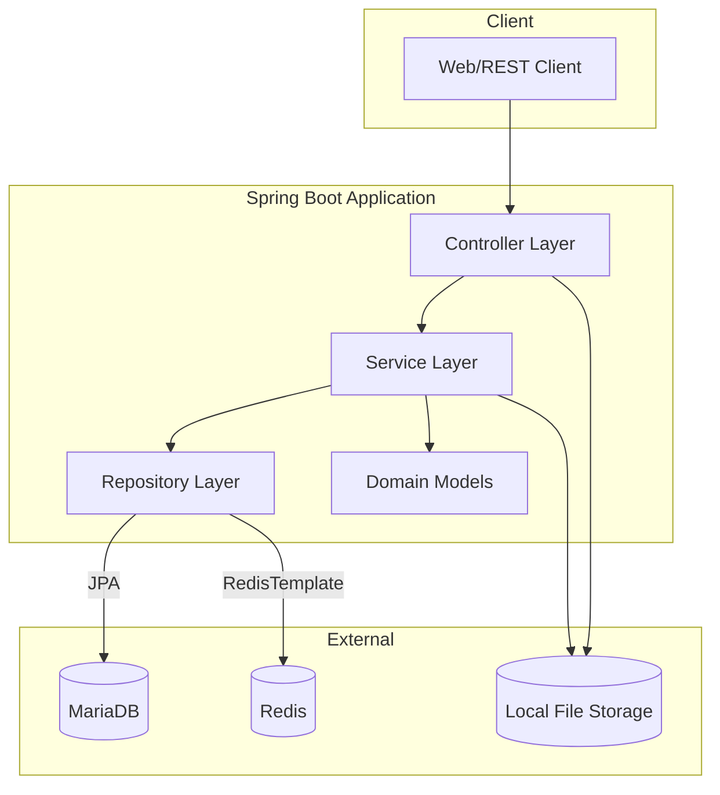

# 🏛️ Free Community Board

대용량 데이터를 처리하면서 겪을 수 있는 아키텍처 사고와, 쿼리 튜닝과 과련된  Java&Spring 토이 프로젝트입니다.  
Spring Boot, JPA, Redis, MariaDB 기반으로 익명 게시, 실시간 인기글, 악용 방지, 강력한 신고/제재 기능을 지원합니다.

---

## 🚀 주요 기능

- **회원 관리:** 회원가입, 프로필, 활동 이력(최근 한 달), 닉네임 기반 익명성
- **게시글:** 작성/수정/삭제, 이미지 업로드, 페이지네이션/무한스크롤, 검색, 좋아요/취소, 조회수
- **댓글:** 2단계 중첩, 익명, 좋아요/취소, 페이지네이션, 부모/자식 삭제 정책
- **신고/제재:** 게시글/댓글 신고, 1일 5회 이상 신고 시 3일간 활동 정지
- **인기글:** 실시간 인기글 TOP 10(1시간마다 갱신), 점수 기반 랭킹
- **성능:** Redis(실시간 카운터/락/랭킹), MariaDB(영구 저장), QueryDSL(고급 검색)
- **테스트:** 컨트롤러/서비스/레포지토리 70% 이상 커버리지

---

## ⚙️ 기술 스택

- Java 17
- Spring Boot 3.4+
- Spring Data JPA & Redis
- MariaDB
- QueryDSL
- Lombok
- JUnit 5, H2(테스트)

---

## 🏗️ 아키텍처

본 프로젝트는 유지보수성과 확장성을 고려한 레이어드 아키텍처를 따릅니다.

- **Controller:** REST API 요청/응답 처리
- **Service:** 비즈니스 로직, 트랜잭션, 레포지토리 조합
- **Repository:** JPA(MariaDB), RedisTemplate(Redis) 데이터 접근
- **Domain:** 핵심 비즈니스 엔티티(회원, 게시글, 댓글 등)
- **외부 시스템:**  
  - **MariaDB:** 영구 데이터 저장  
  - **Redis:** 실시간 카운터, 락, 인기글 랭킹  
  - **로컬 파일:** 이미지 저장

### 아키텍처 다이어그램



---

## 🛠️ 설치 및 실행

### 요구사항

- Java 17 이상
- Gradle 8 이상
- MariaDB (기본: 로컬)
- Redis (기본: 로컬)

### 설치

```bash
git clone <repo-url>
cd free_commnunity_1
```

### 빌드 및 실행

```bash
./gradlew build
./gradlew bootRun
```

### 테스트 실행

```bash
./gradlew test
```

---

## 📚 API 요약

| 리소스   | 엔드포인트 | 설명 |
|----------|------------|------|
| 회원     | `POST /users` | 회원 생성 |
|          | `GET /users/{userId}` | 회원 정보 조회 |
|          | `PATCH /users/{userId}` | 회원 정보 수정 |
|          | `GET /users/{userId}/history` | 최근 게시글/댓글 |
| 게시글   | `POST /posts` | 게시글 작성(이미지+JSON) |
|          | `GET /posts` | 게시글 목록(페이지네이션/정렬) |
|          | `GET /posts-infinite` | 무한스크롤 게시글 |
|          | `GET /posts/{postId}` | 게시글 상세 |
|          | `PATCH /posts/{postId}` | 게시글 수정 |
|          | `DELETE /posts/{postId}` | 게시글 삭제 |
|          | `POST /posts/{postId}/likes` | 게시글 좋아요/취소 |
| 댓글     | `POST /posts/{postId}/comments` | 댓글 작성 |
|          | `PATCH /posts/{postId}/comments/{commentId}` | 댓글 수정 |
|          | `DELETE /posts/{postId}/comments/{commentId}` | 댓글 삭제 |
|          | `POST /posts/{postId}/comments/{commentId}/like` | 댓글 좋아요/취소 |
| 인기글   | `GET /posts/hot` | 인기글 TOP 10 |
| 신고     | `POST /report` | 게시글/댓글 신고 |

---

## 🔒 정책 및 규칙

- **조회수:**  
  - 한 사용자는 5분에 한 번만 해당 게시글 조회수 증가(레디스 락)
  - 50회마다 DB에 백업

- **좋아요:**  
  - 게시글/댓글별 1인 1회 좋아요/취소

- **인기글:**  
  - 1시간마다 TOP 10 재계산  
  - 점수 = (좋아요 수 * 2) + (조회수 * 1)

- **신고/제재:**  
  - 1일 5회 이상 신고 시 3일간 활동 정지  
  - 신고 사유: 욕설, 광고, 매크로, 인신공격 등  
  - 신고 카운트는 매일 초기화

---

## 🧪 테스트

- 전체 테스트 실행:  
  ```bash
  ./gradlew test
  ```
- 단위 테스트 커버리지: 80% 이상(서비스, 레포지토리)

---
