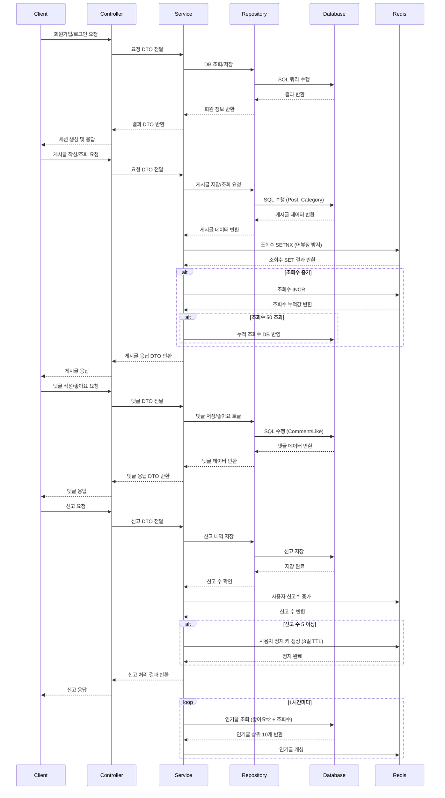

### 자유 게시판 프로젝트 요구사항 및 정책

🗒️  **요구사항 및 기능**

1. **회원 관리**
    - [x]  회원 정보 관리
        - [x]  사용자 활동 이력 관리(최근 작성한 게시글/댓글 관리)
            - [x]  최근 1달이내 작성한 게시글을 불러온다.
            - [x]  최근 1달이내 작성한 댓글을 불러온다.
        - [x]  닉네임 중복가능
2. 게시글 관리
    - [x]  게시글 작성 / 수정 / 삭제
        - [x]  글 작성 시 제목, 본문 텍스트, 이미지 파일 첨부 기능
        - [x]  게시글 수정, 삭제 기능
        - [x]  자유 게시판의 성격을 띄는 만큼 익명성이(Nickname으로 활동) 보장된다.
            - [x]  게시글 작성 시 닉네임이 표기 된다.
    - [x]  게시글 조회
        - [x]  상세 조회 시 - 제목, 내용, 작성자 닉네임(고정 닉네임일 경우 표시), 이미지, 댓글(노출 순서는 가장 오래된 순), 조회수, 댓글 수, 좋아요 수, 작성 날짜, 최종 수정 날짜
        - [x]  페이지네이션
            - [x]  페이지네이션 - 조회수순 (viewCount)
        - [x]  무한 스크롤 페이지 네이션
            - [x]  페이지네이션 최신순,
            - [x]  페이지네이션 조회수 순
        - [x]  조회수 어뷰징 방지 정책
            - [x]  각 사용자는 게시글 1개당 10분에 1번 조회수가 집계된다.(3분동안 100번 조회하더라도 1번만 집계된다.) - 조회수 데이터 저장 성공 시 조회 내역이 없었음을 의미하기 때문에 조회수 1증가
        - [x]  검색 기능 : 제목, 카테고리 게시글 검색 가능
        - [x]  게시글 좋아요 기능
3. 댓글 관리
    - 댓글 페이징 쿼리, 페이징 완료 O
    - [x]  댓글 작성O / 수정O/ 삭제O
        - [x]  게시글에 댓글을 작성하고, 댓글 수정 및 삭제 기능 제공
            - [x]  댓글 작성 시 기본적으로 익명성을 보장한다.(Snowflake로 DB를 설계하고 응답에는 익명으로 정한 내용이 들어간다거나 하는식으로)
        - [x]  댓글은 최대 2depth 가능
            - [x]  삭제 시 부모 댓글 삭제여부에 따라 완전히 지움과 ‘해당 댓글은 작성자에 의해 삭제되었습니다’메시지 표시
        - [x]  좋아요
            - [x]  루트 댓글 기준 좋아요 순
            - [x]  toggle 기능 제공 → 한 사람당 한번만 해당 댓글에 좋아요 가능 한번 더 누르면 좋아요 취소
4. 신고 시스템
    - [x]  게시글 및 댓글 신고
        - [x]  게시글이나 댓글을 신고할 수 있는 기능 제공(신고 사유 : 욕설, 음란물, 광고 등등)
        - [x]  N회 이상 신고된 콘텐츠는 (신고에 의해 삭제된 댓글, 신고에 의해 삭제된 게시글 입니다. 로 표기)
        - [x]  유저에 대한 신고 5회 이상 시 게시글 및 댓글 작성 3일간 작성 금지
5. 검색 및 필터링
    - [x]  게시글 검색 기능
        - [x]  게시글의 제목, 카테고리 등으로 검색이 가능하도록 구현 특정 키워드에 대한 검색 결과 제공
        - [x]  최신 게시글
        - [x]  인기 게시글
    - [x]  카테고리
        - [x]  게시글을 카테고리별로 구분하여 관리(자유 게시판, 연애, 스포츠 등등)
6. 성능 테스트
    - [x]  API 별로 성능 테스트
        - [x]  보조 인덱스 설정
7. 단위 테스트
    - [x]  Controller, Service, Repository 단위 테스트 커버리지 모두 70%이상

---

### 💡프로젝트 정책

🚀 조회수 어뷰징 방지 정책

- 각 사용자는 게시글 1개당 5분에 1번만 조회수가 집계된다.
- 3분 동안 100번 조회하더라도 1번만 집계된다.

🚀 조회 여부 정책

- 로그인 사용자 ID별로 식별
- 각 사용자가 5분 내에 게시글을 조회했었다는 사실을 알 수 있는 방법
    - Redis의 setIfAbsent함수를 이용해서 특정 User관련해서 락을 잡아둔다.
- 조회수 백업 정책 한 게시글 당 조회수 50개를 기준으로 DB에 백업할 수 있도록 해둔다.

🚀 좋아요 정책

- 각 사용자는 게시글마다 좋아요를 누를 수 있다. 취소도 가능하다.
- 좋아요는 각 게시글 마다 1회만 수행되어야한다.

🚀 인기글 정책

- 실시간 인기글 업데이트 10건 1시간마다 업데이트
- 좋아요 수/ 조회 수 기반으로 점수를 계산한다.
    - 점수 = 좋아요 수 * 2 + 조회수 * 1

🚀 신고 정책

- POST 및 COMMENT를 기준으로 하루에 N회 이상 신고될 경우 페널티 부여
    - 하루에 5회 이상일 경우 페널티 부여. 하루가 넘어가면 초기화
    - 하루에 5회 이상 해당 유저의 POST 및 COMMENT가 신고될 경우
        - 3일 동안 게시글 작성 및 댓글 작성 금지
---


```
